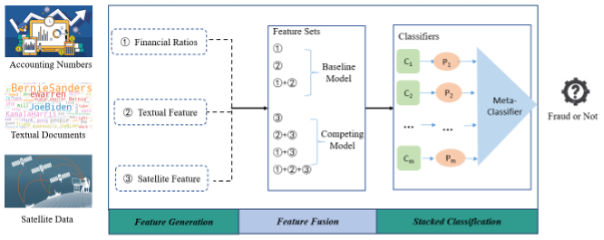

# Eye in the Sky: Monitoring Financial Fraud using Satellite Data

The contributions of this research are two-fold. First, our research contributes to the financial fraud detection by introducing satellite data to achieve a better performance. The performance improvement confirms the existence of relationship between satellite data and firm financial performance, which suggests that satellite data can be used as signals for firm financial analysis. Second, this study proposes a framework to integrate multiple sources of features. A method of fusing features and classifiers is designed to reduce the declarative and procedural bias for a given classification task. Experiments show that this design leads to further performance improvement for fraud detection. 

This repository stores code from data fusion to model prediction, but the code capability is not strong, for reference only. All code is compiled using Python 3.8
* Data Fusion
* Prediction
* Feature selection

## Data Fusion
Environment: Pytorch 1.x

Data_fusion. py contains three data fusion methods, namely Concat, CompactBilinarPooling, and TensorFusion. After generating three different fusion data, they are compared on CM4.

## Prediction
Environment：Tensorflow 2.x

#### Baseline
The baseline shows the model from CM1 to CM4. The evaluation criteria predicted by LR, SVM, XGBoost, and CNN will be presented separately.
#### CM5
cm5. py shows the stacking model CM5 that only uses three types of data fusion.
#### CM6
cm6. py shows the final stacking model. Replacing different fused datasets in cm6.py will also draw different feature importance.
stacking roc. py displays the ROC curves of the CM4, CM5, and CM6 models, demonstrating the superiority of the CM6 model, while cost_roc. py displays the ROC curves of the CM6 model after adding error costs.

The above three prediction files can be directly run together through main.py. And the cm6_demo can display the prediction process and results of the cm6 model.

## Feature selection
The top30_features.py shows the importance ranking of three types of feature data, with the higher the ranking, the greater the impact of this feature on fraud prediction.
